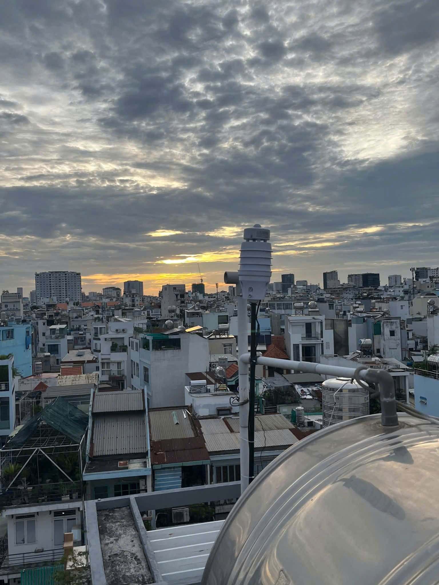
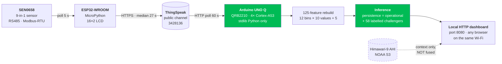
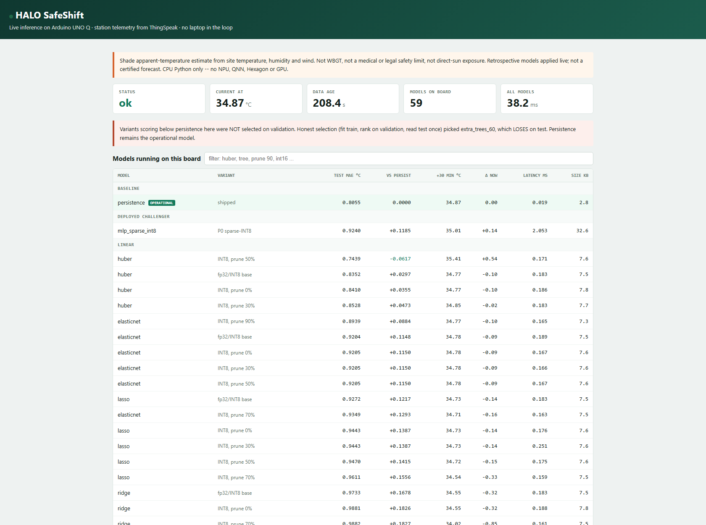
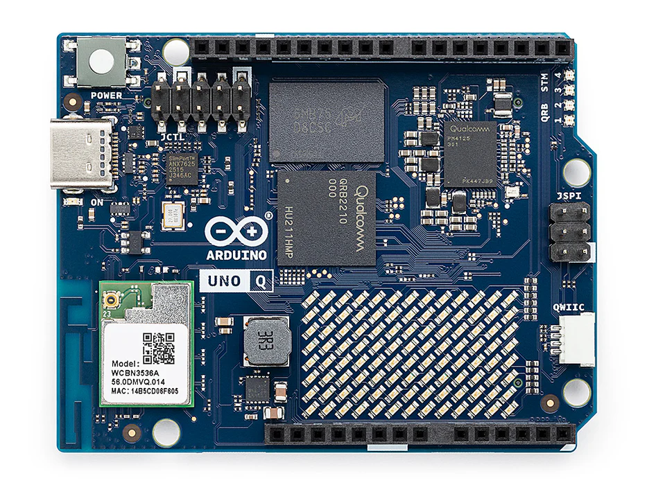
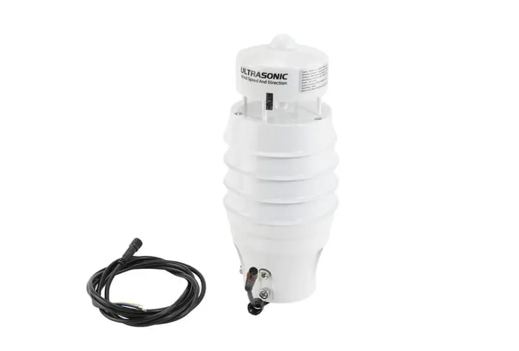
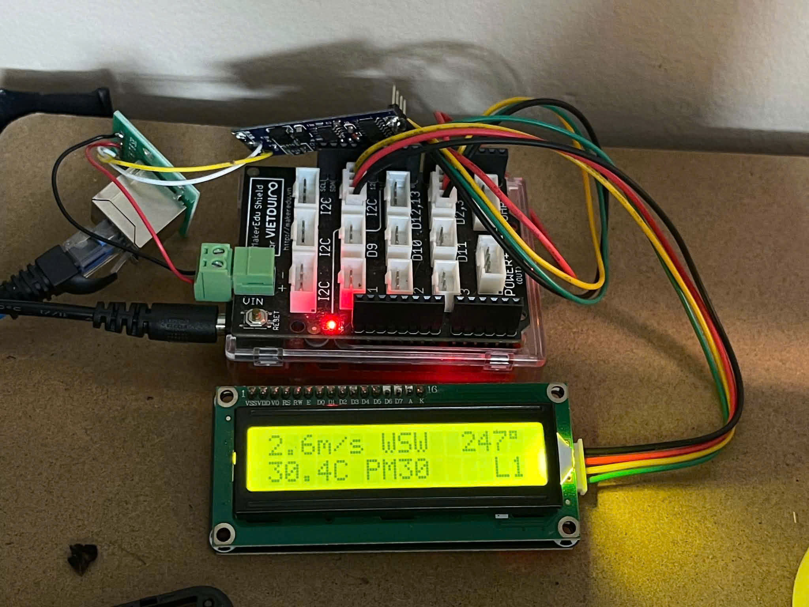
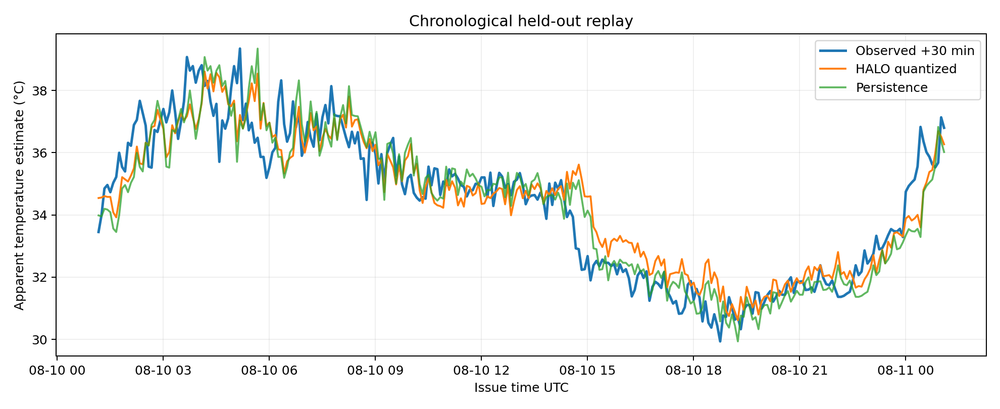
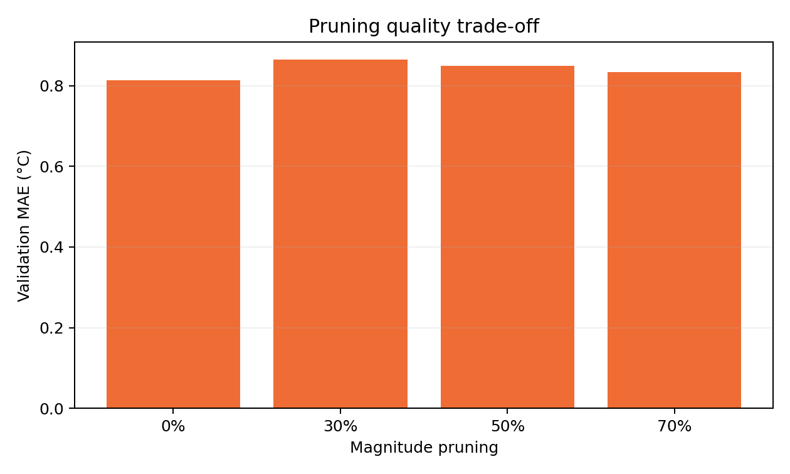
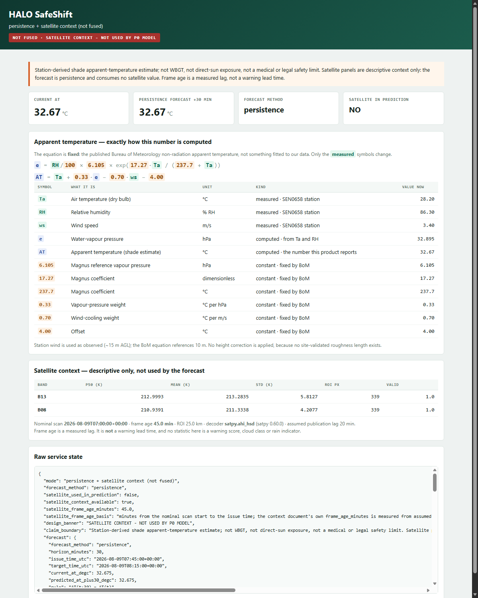

# HALO SafeShift

**A 30-minute-ahead hyperlocal heat forecast that runs entirely on an Arduino UNO Q.**

Team MakerLabVN · Hack The Challenge 2026

A rooftop weather station in Ho Chi Minh City publishes its own microclimate every
27 seconds. An Arduino UNO Q pulls that telemetry, rebuilds a 125-feature vector,
and predicts the site's **shade apparent temperature 30 minutes from now** — so an
outdoor-worksite safety officer can decide, half an hour early, whether to trigger
the site's prepared water / shade / work-rest plan.

No laptop in the loop. No cloud inference. Plug in power and Wi-Fi, open the page.

---

## Read this before anything else: what this is, and what it is not

This repository ships a **negative headline result**, on purpose.

> **The learned models lost. Persistence ships.**
>
> We set the gate before training: a learned model is deployed only if it beats
> persistence on the untouched chronological holdout by **≥ 0.05 °C MAE and ≥ 5 %
> relative**. It did not. On the held-out test set the tuned MLP scores **0.924 °C
> MAE** against persistence's **0.806 °C**. So the operational model is
> persistence, and this README says so instead of quoting the validation number
> that would have looked better.

The engineering contribution is therefore *not* "our model is accurate." It is:
an honest selection protocol that caught its own overfit, a 125-feature pipeline
that reconstructs identically on a board with no NumPy, and a **33×** inference
speedup achieved in pure standard-library Python on the UNO Q's Cortex-A53s.

**What this system is not** — these boundaries are enforced in code, printed on the
dashboard, and repeated in every evidence artifact:

- **Not WBGT.** It is the Australian Bureau of Meteorology non-radiation apparent
  temperature, computed in shade from air temperature, humidity and wind.
- **Not a medical prediction, and not a legal safety limit.** It informs a
  human decision; it does not make one.
- **Not direct-sun exposure.** No radiation term, no black-globe instrument.
- **Not accelerated by an NPU.** Inference is CPU Python. No QNN, no Hexagon, no
  GPU delegate is used or claimed anywhere in this repository.
- **Not a certified forecast.** Retrospectively-evaluated models applied live.
- **Not rain detection.** The sensor has no rain gauge (see [Sensor](#the-sensor)).

---

## The system



*The station that produces every input this system consumes — a DFRobot SEN0658
9-in-1 sensor on a rooftop mast at approximately 15 m above local ground,
109 Lê Văn Duyệt, Gia Định, HCMC.*



The dashed satellite link is deliberate. Himawari-9 imagery is served **beside** the
forecast as descriptive context and is **not consumed by any deployed model** —
see [Satellite context](#satellite-context-served-not-fused).

### The board, serving its own dashboard



*Served by `edge/halo_live.py` running on the UNO Q itself. Every model in the
table is executing on the board. The pink banner is generated from the selection
record, not hand-written: it states that the honest-selection winner loses on test
and that persistence remains operational.*

---

## Hardware

| Role | Part | Detail |
|---|---|---|
| Inference | **Arduino UNO Q** | Qualcomm Dragonwing **QRB2210**, 4× Arm Cortex-A53 @ 2.0 GHz, Adreno GPU (unused), Debian trixie aarch64, Python 3.13.5 |
| Real-time MCU | ST **STM32U585** | Cortex-M33 @ ≤160 MHz, 2 MB flash, 786 kB SRAM, Zephyr. Bridged to the MPU by Arduino Bridge RPC, measured **4.64 ms** median per call |
| Sensing | **ESP32-WROOM** | MicroPython, RS485 master, 16×2 I²C LCD |
| Sensor | **DFRobot SEN0658** | 9 parameters, RS485 / Modbus-RTU, IP54, 10–30 V DC |
| Transport | **ThingSpeak** | Public channel `3428136`, 8 published fields |

 

*Left: Arduino UNO Q. Right: DFRobot SEN0658. Both are manufacturer product
photographs, used for identification and disclosed in
[License and attributions](#license-and-attributions).*



*The sensing node on the bench. The RS485 adapter (top left) bridges Modbus-RTU to
UART2; the LCD shows the same values the firmware is about to publish —
`2.6 m/s WSW 247°`, `30.4 °C`, PM 30, and the `L1` status line.*

### The sensor

The SEN0658 measures **nine** parameters: ultrasonic wind speed and direction,
temperature, humidity, pressure, illuminance, noise, PM2.5 and PM10.

**None of them is rainfall.** Several retailer listings carry the word "Rain" in the
product title; the parameter list on the [DFRobot wiki](https://wiki.dfrobot.com/sen0658/),
Mouser and DigiKey has no precipitation channel. This repository never claims a rain
measurement, and no model here is trained on one.

A free ThingSpeak channel has eight field slots, so **PM10 is measured but not
published** — historical PM10 is genuinely absent from `data/`, not merely unexported.

Full wiring, register map, timing constants and the station's known failure modes:
**[`firmware/README.md`](firmware/README.md)**.

---

## The prediction target

The shade apparent temperature `AT`, from the Bureau of Meteorology non-radiation
formula. The equation is **fixed and published** — it is not fitted to our data.
Only the three measured inputs change:

```
e  = (RH / 100) × 6.105 × exp( 17.27 × Ta / (237.7 + Ta) )
AT = Ta + 0.33 × e − 0.70 × ws − 4.00
```

| Symbol | Meaning | Unit | Source |
|---|---|---|---|
| `Ta` | Air temperature (dry bulb) | °C | measured — SEN0658 |
| `RH` | Relative humidity | % | measured — SEN0658 |
| `ws` | Wind speed | m/s | measured — SEN0658 |
| `e` | Water-vapour pressure | hPa | computed |
| `AT` | Apparent temperature, shade | °C | **the number this product reports** |

Station wind is used as observed at ~15 m AGL; the BoM equation references 10 m. **No
height correction is applied**, because no site-validated roughness length exists.
That is a known, stated approximation — not a silent one.

The task is to predict `AT(t + 30 min)` from data available at `t`.

---

## Data and method

| Stage | Value |
|---|---|
| Raw rows exported from the public channel | **74,700** |
| Rejected as physically implausible or missing | 116 |
| Valid 5-minute bins | **6,815** |
| Eligible 12-bin windows | **6,628** |
| Features per window | **125** |
| Coverage | 2026-07-21T17:25Z → 2026-08-15T20:35Z |

**Feature construction.** 12 consecutive 5-minute bins spanning `t−55 min … t`. Each
bin is the **median** of its raw samples and requires at least 6 samples. Each bin
contributes 10 values — temperature, humidity, wind speed, wind-direction sine and
cosine, `log1p` illuminance, pressure, `log1p` PM2.5, noise, and `AT` — plus 5 window
extras: `AT` now, and sine/cosine encodings of local time and day of year.
Bins use `label="right"`, `closed="right"`.

If fewer than 12 consecutive complete bins are available the service reports
**NOT READY and refuses to predict.** It never extrapolates or back-fills.

**Splitting.** Chronological 60/20/20 with a **90-minute embargo** between segments,
so no window can straddle a boundary and leak its own future.

| Split | Windows | Range (UTC) |
|---|---|---|
| Train | 3,958 | 2026-07-21T18:20 → 2026-08-05T04:35 |
| Validation | 1,290 | 2026-08-05T07:40 → 2026-08-09T22:05 |
| Test | 1,308 | 2026-08-10T01:10 → 2026-08-15T20:05 |

**Protocol.** Fit on train → rank on validation → refit on train+validation → **read
test exactly once.** Recorded in [`edge/honest_selection.json`](edge/honest_selection.json).

---

## Results — including the one that did not work

### The honest-selection record

Eight model families were fitted and ranked on validation. `extra_trees_60` won it
convincingly. Then the test set was opened, once:

| Model | Validation MAE (°C) | Test MAE (°C) |
|---|---|---|
| **persistence** (baseline) | 0.8352 | **0.8055** |
| extra_trees_60 — *validation winner* | **0.7501** | 0.8362 |
| random_forest_60 | 0.7579 | — |
| grad_boost_100 | 0.7610 | — |
| elasticnet | 0.7983 | — |
| lasso | 0.8422 | — |
| huber | 0.8525 | — |
| ridge | 0.9076 | — |
| mlp_64_32 | 0.9689 | — |

The validation winner beat persistence by 0.085 °C on validation and **lost to it by
0.031 °C on test.** The recorded verdict is literal:

```json
"verdict": "NOT AN HONEST GAIN: do not quote a learned win"
```

The separately-trained deep pipeline reached the same conclusion — MLP test MAE
0.924 °C against persistence 0.806 °C, `"learned_model_gate": false` — so
**`operational_model` is `persistence`** in [`edge/metrics.json`](edge/metrics.json).



*The held-out replay. The three traces sit close together across the full test
window — which is exactly why the gate exists, and why a 0.03 °C validation-only
gain does not earn a deployment.*

### Why persistence is a respectable answer here

Over a 30-minute horizon at 5-minute resolution, in a tropical urban microclimate,
"the apparent temperature will be roughly what it is now" is a genuinely strong
predictor. Reporting that honestly is more useful to a safety officer than shipping
a model that is 15 % worse and calling it AI.

The learned model is still **deployed on the board — labelled as a challenger** — so
the comparison stays live and visible instead of being buried in a notebook.

---

## On-device optimization — the real engineering result

This is where the work is. All figures measured **on the UNO Q**, two independent
runs, medians agreeing within 1.5 %. Evidence:
[`evidence/board/board-runtime-optimized.json`](evidence/board/board-runtime-optimized.json).

The board has **no NumPy** (`ModuleNotFoundError`), so the runtime is pure standard
library. That constraint is what makes the speedup interesting.

| Runner | Model | Median (ms) | p95 (ms) | Speedup |
|---|---|---|---|---|
| `edge_runner.py` baseline | persistence | 0.0433 | 0.0453 | — |
| `edge_runner_fast.py` | persistence | **0.0013** | 0.0014 | **33.24×** |
| `edge_runner.py` baseline | sparse-INT8 MLP | 2.4356 | 2.4584 | — |
| `edge_runner_fast.py` | sparse-INT8 MLP | **1.0776** | 1.1016 | **2.26×** |

Throughput for the MLP rose from **411 to 928 inferences/second** on the board.

**Model shape:** `125 → 64 → 32 → 1`, 10,080 dense weights pruned to **3,025 non-zero
(69.98 % sparsity)**, INT8 weights with a per-layer float scale.

**The four optimizations, in order of effect:**

1. `int()` / `float()` casts hoisted out of the hot loop — 3,025 casts removed per call.
2. Normalisation `(v − mean) / scale` folded to `v × a + b` — division becomes
   multiplication, two operations become one.
3. The per-layer INT8 `weight_scale` folded into the weights — one multiply per
   neuron removed.
4. The Python multiply-accumulate loop replaced by
   `sum(map(mul, weights, itemgetter(*idx)(h)))`, which runs gather + multiply +
   accumulate in C rather than in the interpreter.

**Numerical agreement, stated precisely.** Persistence is **bit-identical** to the
baseline. The MLP differs by **~1.5 × 10⁻¹⁴** on the board and 2.13 × 10⁻¹⁴ on x86 —
float re-association from folding the INT8 scale and the normalisation, **not** a
different model. The artifact says it plainly: *"This is not zero and must not be
reported as zero."*



*Pruning sparsity against validation MAE. 70 % sparsity was selected **on validation**,
not on test.*

### Quantization: what it bought, and what it did not

| Format | Size (bytes) |
|---|---|
| TFLite fp32 | 42,672 |
| TFLite dynamic INT8 | 13,696 |
| TFLite full INT8 | 14,968 |

Quantization buys **footprint**, and on this CPU path it did not buy latency. An
earlier INT16 tree-export experiment made the files *larger*, which is recorded rather
than quietly dropped.

---

## Satellite context — served, not fused



Himawari-9 AHI bands **B13** and **B08**, segment 04, resolution R20, pulled anonymously
from the public NOAA S3 bucket and decoded with a dependency-free reader. The result is
displayed beside the forecast with a permanent banner:

> `NOT FUSED · SATELLITE CONTEXT — NOT USED BY P0 MODEL`

The machine-readable status is unambiguous: `"satellite_used_in_prediction": false`.

**Why it is not fused.** Because we measured the thing that decides whether it *can*
be, and the answer constrains the design.

### Publication latency, measured

Three consecutive nominal 10-minute slots were polled by HTTP HEAD every 20 s from
the slot's nominal time until the exact object we need answered 200.
Evidence: [`evidence/network/V5-publication-latency.md`](evidence/network/V5-publication-latency.md).

| Nominal slot (UTC) | Published after | Polls |
|---|---|---|
| 11:40 | **11.79 min** | 35 |
| 11:50 | **11.96 min** | 30 |
| 12:00 | **11.77 min** | 29 |

3/3 slots, median **11.79 min**, total spread 11 seconds.

| Stage | Time |
|---|---|
| Nominal scan → object downloadable | **11.8 – 12.0 min** |
| Fetch + bz2 decompress on the board over 4G | 15.4 s |
| NumPy decode | 0.36 s |
| **One segment, end to end** | **≈ 12.1 min** |
| Two segments (our ROI spills into segment 05) | **≈ 12.3 min** |

**Publication is 97 % of that delay.** The 4G link and the Cortex-A53 are almost
irrelevant to freshness, and *nothing done to the board can improve it*. Worse, because
files arrive every 10 minutes while each takes ~11.8 minutes to appear, the newest
available frame keeps ageing between publications: the number to plan against is
**17 minutes, and at worst 22.**

**Therefore this repository makes no satellite lead-time claim in either direction.**
Frame age is reported as a *measured lag*, never as a warning lead time. Fusing a
17-to-22-minute-old frame into a 30-minute forecast has to be *earned* on a holdout
before it is claimed, and it has not been.

The satellite path also **degrades explicitly** rather than silently — each of these
still serves the persistence forecast:

| Failure | Behaviour |
|---|---|
| Context file absent | `"satellite context file is absent"` |
| Context file corrupt | `"satellite context is unreadable: …"` |
| Frame older than the freshness limit | `"frame is stale: 45.0 min old exceeds the 10 min freshness limit"` |

---

## Repository layout

```
.
├── firmware/          ESP32 MicroPython station firmware + credential template
├── prototype/         The halo_safeshift Python package: QC, features, splits,
│   halo_safeshift/    models, export, contracts, runtime — and 288 tests
├── notebooks/         Colab training notebooks + run book
├── benchmarks/halo/   Station puller, Himawari HSD decoder, NASA POWER probe,
│                      network and publication-latency measurement
├── edge/              Everything that ships to the board: runners, models,
│   ├── sweep/         feature schema, live service, systemd unit, benchmarks
│   └── ...            + the full 8-family × 5-sparsity sweep
├── evidence/          Measured artifacts, each carrying its own claim boundary
│   ├── board/         UNO Q inference latency, two independent runs
│   ├── network/       Himawari publication latency and transport
│   ├── satellite-context/
│   └── pipeline-run/  QC, folds, manifests, hashes of the training packet
├── data/              The frozen 74,700-row station export the models were built on
└── images/            Figures used by this README
```

### Key files

| File | What it holds |
|---|---|
| [`edge/metrics.json`](edge/metrics.json) | Full training record: QC, split, gate result, pruning, quantization |
| [`edge/honest_selection.json`](edge/honest_selection.json) | The selection protocol and its verdict |
| [`edge/model_catalog.json`](edge/model_catalog.json) | All 59 board-deployable variants with test MAE and size |
| [`edge/feature_schema.json`](edge/feature_schema.json) | The 125-feature contract, authoritative for both sides |
| [`edge/halo_live.py`](edge/halo_live.py) | The standalone board service (stdlib only) |
| [`edge/manifest.json`](edge/manifest.json) | SHA-256 of every shipped artifact |
| [`evidence/satellite-context/commands.txt`](evidence/satellite-context/commands.txt) | Every command run, in order, to reproduce the satellite pass |

---

## Reproducing this

**Requirements:** Python 3.12+, `numpy`, `pandas`, `scikit-learn`. TensorFlow only
for the TFLite export path. Nothing beyond the standard library is needed on the board.

```bash
# 1. Run the full test suite (288 tests)
python -m pytest prototype/halo_safeshift/tests -q

# 2. Verify all 14 shipped artifacts against their recorded SHA-256
python edge/verify_manifest.py        # exits non-zero on any mismatch

# 3. Reproduce the inference benchmark, and 4. run the live service.
#    Both run from inside edge/ — that directory is deliberately flat because it
#    is copied verbatim to the board, where every file sits in one directory.
cd edge
python bench_inference.py                                  # baseline vs optimized
python halo_live.py --catalog model_catalog.json --host 127.0.0.1 --port 8080
```

The live service reads the **public** ThingSpeak channel over plain HTTP and needs
no credentials, so step 4 works off-board on any machine with internet access. Open
`http://127.0.0.1:8080` to get the dashboard shown above.

**On the UNO Q**, over ADB or SSH:

```bash
adb push edge/ /home/arduino/halo-safeshift/
adb shell "cd /home/arduino/halo-safeshift && sh start_live.sh"
# then open http://<board-ip>:8080 from any browser on the same network
```

`edge/halo-live.service` is a systemd unit for unattended start. Note that
`start_live.sh` uses `setsid` deliberately — a bare `nohup` does not survive the
ADB session teardown on this image.

**Training** runs on Colab, not on the development laptop — see
[`notebooks/RUNBOOK.md`](notebooks/RUNBOOK.md).

### Test suite status — stated exactly

```
285 passed, 1 skipped, 2 failed
```

This is the honest current state, not a rounded one:

- **2 failures**, both pre-existing and both in the optional XGBoost path. XGBoost is
  marked **BLOCKED** in this project precisely *because* of the second one: its
  portable tree export disagrees with the library by 1.394 against a 1 × 10⁻⁵
  tolerance. The failing tests are the guards that detect it. They fail only when
  `xgboost` happens to be installed locally; XGBoost is not used by any shipped model.
- **1 skip**: `the reused freeze is not present in this checkout`. That freeze belongs
  to an internal research archive that is deliberately not part of this public
  repository. The test degrades rather than pretending to pass.

---

## Complete list of claim boundaries

Every one of these is enforced somewhere in code or printed in an artifact, not just
asserted here.

| # | We do **not** claim |
|---|---|
| 1 | WBGT, or any heat-stress index other than BoM shade apparent temperature |
| 2 | A medical prediction, a diagnosis, or a legal/regulatory safety threshold |
| 3 | Direct-sun or radiant exposure — there is no radiation term and no black globe |
| 4 | NPU, QNN, Hexagon or GPU acceleration. Every measurement here is CPU Python |
| 5 | That the learned model beats persistence — measured, it does not |
| 6 | Any satellite warning lead time, in either direction |
| 7 | Rainfall measurement — the sensor has no rain gauge |
| 8 | That satellite data contributes to the prediction — `satellite_used_in_prediction: false` |
| 9 | A certified, prospective or operational forecast. Evaluation is retrospective chronological holdout |
| 10 | Any accuracy, latency or power number without a path to the artifact that produced it |

**On terminology.** Elsewhere in our exploratory work a threshold rule
(temperature falling ≥ 2 °C while humidity rises ≥ 8 % RH) flagged 28 occurrences in
the station history. Those are described here only as **"occurrences of a threshold
rule we chose."** They are *not* called convective outflow events: cloud shading from
a passing cumulus fits every measurement we hold, no independent precipitation record
confirms any of them, and the discriminating test has not been run. No model in this
repository is trained on those labels.

---

## Team

**MakerLabVN**

| Member | Role |
|---|---|
| Ninh Hoàng Tài Phát | Team Lead — edge AI & embedded |
| Nguyễn Hoàng Trung Sơn | Electronics, PCB & 3D design |
| Nguyễn Quỳnh Anh | Mechanical design |
| Lê Thị Kiều Thoa | Systems integration & communication |

---

## License and attributions

Released under the **MIT License** — see [`LICENSE`](LICENSE).

**Third-party material and data sources:**

| Source | Use | Terms |
|---|---|---|
| [Himawari-9 AHI L1b](https://registry.opendata.aws/noaa-himawari/) via NOAA on AWS | Satellite context imagery | NOAA Open Data, anonymous access |
| [ThingSpeak](https://thingspeak.com/channels/3428136) | Station telemetry transport | Public channel, read access unauthenticated |
| [DFRobot SEN0658](https://wiki.dfrobot.com/sen0658/) documentation | Sensor specifications quoted in this README | Manufacturer documentation, cited |
| Bureau of Meteorology apparent-temperature formula | The prediction target | Published equation, unmodified |
| Arduino UNO Q product photograph (`images/arduino-uno-q.webp`) | Hardware identification | Manufacturer product image, credited here and unmodified. No sponsor logo or mark is used as our own branding |
| DFRobot SEN0658 product photograph (`images/sensor-sen0658.webp`) | Hardware identification | Manufacturer product image, credited here and unmodified |

All other images in `images/` — the station photographs, the dashboard screenshots
and the plots — were produced by this team.

**No credentials are present in this repository.** Wi-Fi and ThingSpeak write keys
are imported by the firmware from `firmware/station_secrets.py`, which is gitignored;
copy [`firmware/station_secrets.example.py`](firmware/station_secrets.example.py) and
fill in your own. The station data in `data/` is our own team's measurement.
